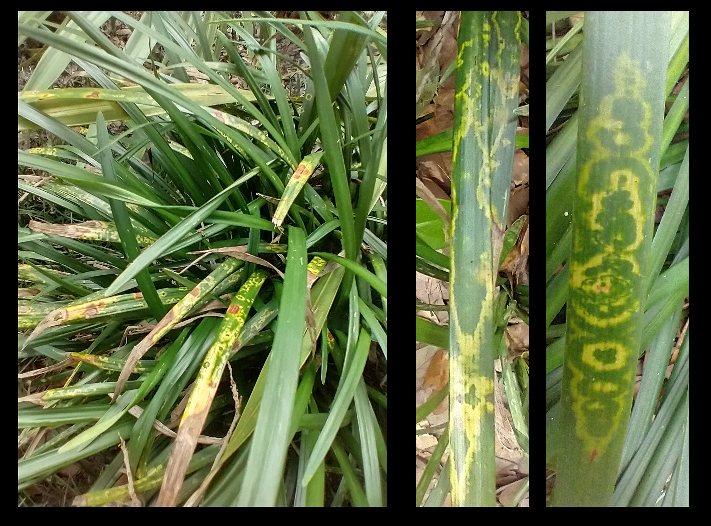
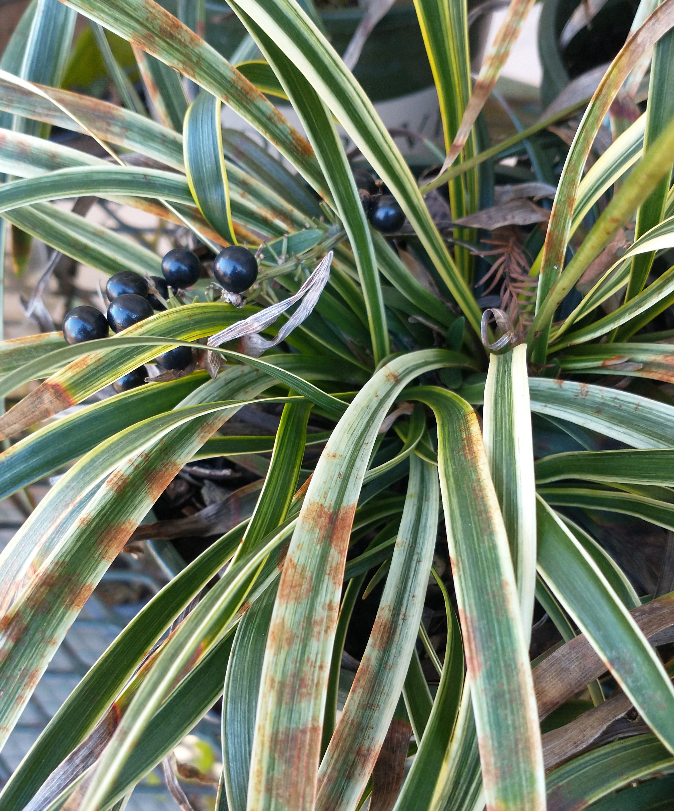

```{r setup, include=FALSE}
#setup options
knitr::opts_chunk$set(fig.width=12, fig.height=8, echo=FALSE)

#a list of packages used for scripts
pkgs <- c('captioner', 'pryr', 'tiff')

#loading required packages
lapply(pkgs, library, character.only = TRUE)
rm(pkgs)

#setting up captions for use in the document
fig_nums <- captioner::captioner(prefix = 'Fig.')
tab_nums <- captioner::captioner(prefix = 'Table')

#allows me to use a custom function instead of the citation function of captioner, which is wordy to use
citef <- pryr::partial(fig_nums, display = "cite")
citet <- pryr::partial(tab_nums, display = "cite")
```

# Chlorotic ringspot symptoms on Giant Lilyturf (*Liriope* spp., cv. ‘Gigantea’)
```{r, warning=FALSE}

```

# Chlorotic leaves on Cast Iron Plant (*Aspidistra elatior*)
```{r, warning=FALSE}
grid::grid.raster(tiff::readTIFF("images/symp-ofv-asp-1.tif"))
```

# Chlorotic spots on *A. elatior* - Early infection?
```{r, warning=FALSE}
grid::grid.raster(tiff::readTIFF("images/symp-ofv-asp-2.tif"))
```

# What was causing these symptoms?
:::::::::::::: {.columns}
::: {.column}
 - Tested negative for begomovirus, potyvirus, tospovirus as well as for Impatiens necrotic spot virus, Tobacco mosaic virus and Tomato spotted wilt virus
 - Sent to the Florida Department of Agriculture and Consumer Services (FDACS) $\rightarrow$ sent to USDA
:::
::: {.column}

:::
::::::::::::::

# Confirmation: *Orchid fleck dichorhavirus* (OFV)
 - Identified using OFV specific conventional reverse transcription polymerase chain assay (RT-PCR) assay + Sanger sequencing + quantitative RT-PCR (RT-qPCR)
 - Presence of Orchid fleck dichorhavirus confirmed using OFV generic R2-Dicho-GF and R2-Dicho-GR primers [@Roy2020] 
 - Sanger sequencing of RT-PCR amplicons shared 98\% nucleotide identity with orchid strains of OFV: OFV-Orc1 and OFV-Orc2 (GenBank Accession numbers: AB244418 and LC222630) [@Kondo2006; @Kondo2017].

# What is OFV?
:::::::::::::: {.columns}
::: {.column}
 - Type member for *Dichorhavirus*, family Rhabdoviridae
 - Other dichorhaviruses: *Citrus chlorotic spot virus*, *Citrus leprosis virus* N, *Clerodendrum chlorotic spot virus* and *Coffee ringspot virus*
 - OFV infects 50+ plant species, including Orchidaceae, Asparagaceae (Nolinoidaea), and Rutaceae (*Citrus*)
 - Flat mites from the genus *Brevipalpus* Donnadieu (Trombidiformes: Tenuipalpidae) only known vectors of dichorhaviruses
:::
::: {.column}

:::
::::::::::::::

# Distribution of OFV
:::::::::::::: {.columns}
::: {.column}
content
:::
::: {.column}
 - First described infecting *Cymbidium* orchids in Japan [@Doi1977]
 - OFV and OFV-like rhabdoviruses have been reported worldwide
 - Asia, Africa, North America, South America, Europe and Oceania
 - Prevalence of OFV and its mite vector is thought to be associated with the movement of infected orchids [@Dietzgen2018a]
:::
::::::::::::::


# Maps
:::::::::::::: {.columns}
::: {.column}
 - Additional samples were taken from other Nolinoidaea, including *Liriope muscari*, *Ophiopogon japonicus*, *O. intermedius* and *Aspidistra elatior* Blume (Asparagaceae: Nolinoidaea) in Leon and Alachua counties.
:::
::: {.column}
content
:::
::::::::::::::


# Mites Recovered
:::::::::::::: {.columns}
::: {.column}
 - Three *Brevipalpus* mite species were recovered from OFV-infected plants: 
  - *Brevipalpus californicus* sensu lato
  - *B. obovatus* Donnadieu 
  - *B. confusus* Banks
- One of these species is presumably responsible for OFV transmission
  - *Brevipalpus californicus* (Banks) group are the only known to transmit OFV in a persistent propagative manner
  - *Brevipalpus* mite species complex contains cryptic species [@Childers2011]
:::
::: {.column}
content
:::
::::::::::::::


# OFV is an issue for Florida agriculture
:::::::::::::: {.columns}
::: {.column}
 - The dichorhavirus that infects citrus in Hawaii, Mexico, Colombia, and South Africa are identical to the OFV in gene order, content, and the genome sequence.
 - ICTV: Officially, OFV consists of two orchid strains (OFV-Orc1 and OFV-Orc2) and two citrus strains (OFV-Cit1 and OFV-Cit2)
 - Orchid strains of OFV infects citrus [@Roy2020], but none of the citrus strains have been reported from any orchid species
 - OFV in Florida represents a concern for horticulturists who grow orchids, *Liriope*, *Ophiopogon*, or other susceptible Asparagaceae species which are commonly used in landscaping
:::
::: {.column}
content
:::
::::::::::::::

 
# Further considerations
 - Florida is also home to a plethora of native and naturalized orchid species
  - Cultivating *Vanilla* in southern Florida [@Chambers2019] 
  - Famous Ghost Orchid, [*Dendrophylax lindenii* (Lindl.) Benth. ex Rolfe].
 - Citrus leprosis was present in Florida during the 1860’s and eradicated in the mid-1960s
 - @Kitajima2011 found that the Citrus Leprosis virus (CiLV) which previously affected Florida citrus was a nuclear type of citrus leprosis closely related to OFV strains [@Roy2013]
  - Association of a distant relative of OFV named Citrus leprosis dichorhavirus-N0 (CiLV-N0) was confirmed in relation to the leprosis disease outbreak in Florida [@Hartung2015].

# Threat for the multi-billion dollar citrus industry
  - Detection of OFV-Orc1 in South Africa [@Cook2019] in *C. sinensis* (Navel and Valencia orange) and OFV-Orc2 in Hawaii [@Velarde2021] in *C. reticulata* (mandarin) and *C. jambhiri* (rough lemon) highlights the threat of different strains of OFV
  - Lastly, some OFV isolates are known to be involved with citrus leprosis disease in Mexico [@Roy2015]

# Mites: a large part of the problem
:::::::::::::: {.columns}
::: {.column}
- Florida has various mite species of *Brevipalpus*:
- *B. californicus* and *B. yothersi* are both known vectors of Dichorhaviruses (OFV) and Cileviruses (Citrus Leprosis) [@Knorr1968; @Kondo2003; @Beltran-Beltran2020]
- *B. obovatus* is a suspected vector as well [@Childers2003]
- *Brevipalpus* mites are known to have cryptic species complexes and unresolved questions about host specificity
- Critical to identify the vector of OFVs in Florida and monitor its spread to determine the risk this virus represents for the native plants, agriculture and the ornamental/landscaping industries of Florida and the surrounding regions.
:::
::: {.column}
content
:::
::::::::::::::

# Conclusions
 - Three new hosts from the family Asperagaceae
 - Need to know the extended host range of OFVs
  - Survey of Florida's citrus growing regions, esp. plants within the families Rutaceae and Asparagaceae
 - Mite species determination: PCR methods?
 - Mite transmission assays

# Acknowledgements
We would like to give a special thanks to the Tallahassee Museum for their patience, cooperation, and support with collecting plant samples. We also want to thank Drs. Sam Bolton, FDACS and Aline Tassi, Univ. of Sao Paulo, Brazil for checking the mites we have sent for species validation. We are especially indebted to the late Dr. Gary Bauchan for his contributions to this study and the field of acarology, he will be greatly missed. This research was partly funded by the USDA National Institute of Food and Agriculture, Hatch project FLA-NFC-005607. Mention of trade names or commercial products in this publication is solely for the purpose of providing specific information and does not imply recommendation or endorsement by the USDA; USDA is an equal opportunity provider and employer.


# References
<div id="refs"></div>