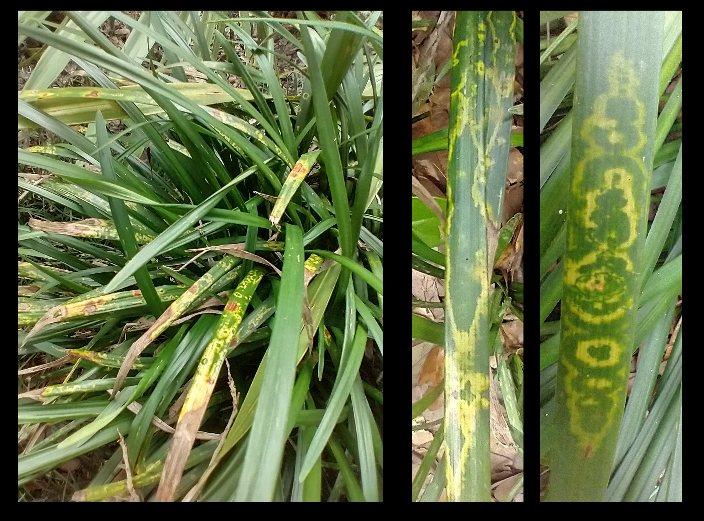

```{r setup, include=FALSE}
#setup options
knitr::opts_chunk$set(fig.width=12, fig.height=8, echo=FALSE)

#a list of packages used for scripts
pkgs <- c('captioner', 'pryr', 'tiff')

#loading required packages
lapply(pkgs, library, character.only = TRUE)
rm(pkgs)

#setting up captions for use in the document
fig_nums <- captioner::captioner(prefix = 'Fig.')
tab_nums <- captioner::captioner(prefix = 'Table')

#allows me to use a custom function instead of the citation function of captioner, which is wordy to use
citef <- pryr::partial(fig_nums, display = "cite")
citet <- pryr::partial(tab_nums, display = "cite")
```

# A visit to the Zoo in June 2020
```{r, warning=FALSE}

```

# Chlorotic ringspot symptoms on Giant Lilyturf (*Liriope* spp., cv. ‘Gigantea’)
```{r, warning=FALSE}

```

# a
```{r, warning=FALSE}
grid::grid.raster(tiff::readTIFF("images/symp-ofv-asp-1.tif"))
```

# a
```{r, warning=FALSE}
grid::grid.raster(tiff::readTIFF("images/symp-ofv-asp-2.tif"))
```

# What was causing these symptoms?
 - Initially tested at the Plant Disease Diagnostic Clinic at the North Florida Research and Education Center (NFREC) in Quincy, FL
 - Tested negative for begomovirus, potyvirus, tospovirus as well as for Impatiens necrotic spot virus, Tobacco mosaic virus and Tomato spotted wilt virus
 - Sent to the Florida Department of Agriculture and Consumer Services (FDACS)

# Confirmation: *Orchid fleck dichorhavirus* (OFV)
 - Identified using OFV specific conventional reverse transcription polymerase chain assay (RT-PCR) assay + Sanger sequencing + quantitative RT-PCR (RT-qPCR)
 - Presence of Orchid fleck dichorhavirus confirmed using OFV generic R2-Dicho-GF and R2-Dicho-GR primers [@Roy2020] 
 - Sanger sequencing of RT-PCR amplicons shared 98\% nucleotide identity with orchid strains of OFV: OFV-Orc1 and OFV-Orc2 (GenBank Accession numbers: AB244418 and LC222630) [@Kondo2006; @Kondo2017].

# What is OFV?
 - Type member for *Dichorhavirus*, family Rhabdoviridae
 - Other dichorhaviruses: *Citrus chlorotic spot virus*, *Citrus leprosis virus* N, *Clerodendrum chlorotic spot virus* and *Coffee ringspot virus*
 - OFV infects 50+ plant species, including Orchidaceae, Asparagaceae (Nolinoidaea), and Rutaceae (*Citrus*)
 - Flat mites from the genus *Brevipalpus* Donnadieu (Trombidiformes: Tenuipalpidae) only known vectors of dichorhaviruses

# Distribution of OFV
 - First described infecting *Cymbidium* orchids in Japan [@Doi1977]
 - OFV and OFV-like rhabdoviruses have been reported worldwide
 - Asia, Africa, North America, South America, Europe and Oceania
 - Prevalence of OFV and its mite vector is thought to be associated with the movement of infected orchids [@Dietzgen2018a]

# Maps
 - Additional samples were taken from other Nolinoidaea, including *Liriope muscari*, *Ophiopogon japonicus*, *O. intermedius* and *Aspidistra elatior* Blume (Asparagaceae: Nolinoidaea) in Leon and Alachua counties.

# Mites Recovered
 - Three *Brevipalpus* mite species were recovered from OFV-infected plants: 
  - *Brevipalpus californicus* sensu lato
  - *B. obovatus* Donnadieu 
  - *B. confusus* Banks
- One of these species is presumably responsible for OFV transmission
  - *Brevipalpus californicus* (Banks) group are the only known to transmit OFV in a persistent propagative manner
  - *Brevipalpus* mite species complex contains cryptic species [@Childers2011]

# OFV is an issue for Florida agriculture
 - The dichorhavirus that infects citrus in Hawaii, Mexico, Colombia, and South Africa are identical to the OFV in gene order, content, and the genome sequence.
 - ICTV: Officially, OFV consists of two orchid strains (OFV-Orc1 and OFV-Orc2) and two citrus strains (OFV-Cit1 and OFV-Cit2)
 - Orchid strains of OFV infects citrus [@Roy2020], but none of the citrus strains have been reported from any orchid species
 - OFV in Florida represents a concern for horticulturists who grow orchids, *Liriope*, *Ophiopogon*, or other susceptible Asparagaceae species which are commonly used in landscaping
 
# Further considerations
 - Florida is also home to a plethora of native and naturalized orchid species
  - Cultivating *Vanilla* in southern Florida [@Chambers2019] 
  - Famous Ghost Orchid, [*Dendrophylax lindenii* (Lindl.) Benth. ex Rolfe].
 - Citrus leprosis was present in Florida during the 1860’s and eradicated in the mid-1960s
 - @Kitajima2011 found that the Citrus Leprosis virus (CiLV) which previously affected Florida citrus was a nuclear type of citrus leprosis closely related to OFV strains [@Roy2013]
  - Association of a distant relative of OFV named Citrus leprosis dichorhavirus-N0 (CiLV-N0) was confirmed in relation to the leprosis disease outbreak in Florida [@Hartung2015].

# Threat for the multi-billion dollar citrus industry
  - Detection of OFV-Orc1 in South Africa [@Cook2019] in *C. sinensis* (Navel and Valencia orange) and OFV-Orc2 in Hawaii [@Velarde2021] in *C. reticulata* (mandarin) and *C. jambhiri* (rough lemon) highlights the threat of different strains of OFV
  - Lastly, some OFV isolates are known to be involved with citrus leprosis disease in Mexico [@Roy2015]

# Mites: a large part of the problem
- *B. californicus* and *B. yothersi* are both known vectors of Dichorhaviruses (OFV) and Cileviruses (Citrus Leprosis) [@Knorr1968; @Kondo2003; @Beltran-Beltran2020]
- *B. obovatus* is a suspected vector as well [@Childers2003]
- All three mite species/complexes are present in Florida [@Childers2003; @Akyazi2017]
- Critical to identify the vector of OFVs in Florida and monitor its spread to determine the risk this virus represents for the native plants, agriculture and the ornamental/landscaping industries of Florida and the surrounding regions.

# Risk to Florida
 - Florida has various mite species of *Brevipalpus*
 - Diverse array of susceptible native and introduced plant species in the landscape
 - OFV already has a wide distribution in Florida which will continue to spread if unchecked
 - Represents a threat for *Liriope* spp., *Ophiopogon* spp. and *Aspidistra elatior* $\rightarrow$ most important ground covers in southeastern US [@Mcharo2003]
 
# Take home and future need for study
 - Three new hosts from the family Asperagaceae
 - Need to know the extended host range of OFVs
  - Survey of Florida's citrus growing regions, esp. plants within the families Rutaceae and Asparagaceae
 - Mite species determination: PCR methods?
 - Mite transmission assays

# Acknowledgements
We would like to give a special thanks to the Tallahassee Museum for their patience, cooperation, and support with collecting plant samples. We also want to thank Drs. Sam Bolton, FDACS and Aline Tassi, Univ. of Sao Paulo, Brazil for checking the mites we have sent for species validation. We are especially indebted to the late Dr. Gary Bauchan for his contributions to this study and the field of acarology, he will be greatly missed. This research was partly funded by the USDA National Institute of Food and Agriculture, Hatch project FLA-NFC-005607. Mention of trade names or commercial products in this publication is solely for the purpose of providing specific information and does not imply recommendation or endorsement by the USDA; USDA is an equal opportunity provider and employer.


# References
<div id="refs"></div>

<!-- # The Citrus Leprosis Disease Complex -->
<!-- - Disease caused by Seven similar viruses, *Citrus leprosis virus* (CiLV) -->
<!-- - Two main groups: -->
<!--      - Cytoplasmic (CiLV-C, Cilevirus) -->
<!--      - Nuclear (CiLV-N, Dichorhavirus), **rarer?** -->
<!-- - Other Cileviruses: Hibiscus-infecting cilevirus -->
<!-- - Other Dichorhaviruses: Citrus chlorotic spot dicorhavirus, Clerodendrum chlorotic spot dichorhavirus, Coffee ringspot dichorhavirus, Orchid fleck dichorhavirus -->

<!-- ```{r cilv_virion, echo=FALSE} -->
<!-- knitr::include_graphics('../images/cilv_virion.jpg') -->
<!-- ``` -->


<!-- # Growing concerns for citrus producers -->
<!-- - Primarily issue for sweet orange: *Citrus sinensis* (L.), some other citrus cultivars -->
<!-- - Non-systemic infections develop, lesions, scaly bark, fruit drop -->
<!-- - Hypersensitive-like response, lesion progresses to become necrotic at center -->
<!-- - High yield loss, ruins fresh market value -->
<!-- - No host plant resistance, Bastianel et al. 2007: CiLV controlled by only a few genes -->


<!-- ```{r citrus_fruits, echo=FALSE} -->
<!-- knitr::include_graphics('../images/citrus_fruits.jpg') -->
<!-- ``` -->


<!-- # Citrus Leprosis Symptoms -->

<!-- ```{r cilv_symp, fig.height=9, fig.width=10.5, echo=FALSE} -->
<!-- knitr::include_graphics('../images/cilv_symptoms.png') -->
<!-- ``` -->


<!-- # Small Cause for Alarm: Tenuipalpid Mites and CiLV -->
<!-- - FL natives: *Brevipalpus phoenicis*, *B. californicus*, *B. obovatus* and *B. yothersi* -->
<!-- - Wide range of host plants, Cryptic species, mite/virus specificity? -->
<!-- - Virus improves mite colonization, inhibits plant defensive pathways -->
<!-- - Thelytokous parthenogenic mites, unfertilized eggs produce females -->
<!-- - Fast population growth: ~14-40 days egg $\rightarrow$ adult, ~0.128 females/female/day -->
<!-- - Short viral acquisition time (4-7 hours), 2 hours of feeding to transmit -->
<!-- - Lesions appear slowly, continue developing 1-2 months after inoculation -->

<!-- ```{r brevi_mite, fig.height=9, fig.width=10.5, echo=FALSE} -->
<!-- knitr::include_graphics('../images/brevi_cali.png') -->
<!-- ``` -->


<!-- # Fresh from Florida: Historical Eradication, Future Reintroduction? -->
<!-- - Main threat for Florida citrus industry between 1900-1925 -->

<!-- - Reports of resurgence of leprosis symptoms 1950s -->

<!-- - Disappeared in early 1960s, eradicated on accident? -->

<!-- - Speculated causes: severe winter freeze in 1966 & new/better pesticides: wettable sulfur &etc. -->

<!-- - Now considered an exotic disease to US -->

<!-- - Review of historical herbarium samples revealed Nuclear type Leprosis, **CiLV-N** -->


<!-- ```{r citrus_label, fig.height=9, fig.width=10.5, echo=FALSE} -->
<!-- knitr::include_graphics('../images/orange_label.png') -->
<!-- ``` -->

<!-- # Map of Citrus Leprosis in World -->
<!-- - CiLV serious problem for Americas: Moving northward: Mexico, Central America, Panama, Paraguay, Peru, Uruguay, Venezuela, Argentina and Brazil -->

<!-- ```{r cilv_map, fig.height=9, fig.width=10.5, echo=FALSE} -->
<!-- knitr::include_graphics('../images/leprosis-Fig1.jpg') -->
<!-- ``` -->

<!-- # Overview of What is Known About Citrus Leprosis Disease -->
<!-- - Citrus Leprosis is a complex of similar diseases transmitted by mites in the genus *Brevipalpus* -->
<!-- - Multiple mite species are involved, and are present in Florida -->
<!-- - *Brevipalpus* mites are known to have cryptic species complexes and unresolved questions about host specificity -->
<!-- - There is some variability in susceptibility of CiLV for different orange cultivars -->
<!-- - Citrus leprosis has been reported from non-citrus plants in citrus groves (both Cytoplasmic and Nuclear types) -->
<!-- - The unusual Nuclear-type Dichorhavirus species of Citrus Leprosis (CiLV-N) was likely the virus devastating Florida oranges in the past, and yet we know very little about CiLV-N and the related Dichorhavirus-disease complexes -->
<!-- - **Some reports of Citrus Leprosis have been found to be caused by another Dichorhavirus closely related to CiLV-N: Orchid Fleck Virus** -->

<!-- # Statement of Research Frontiers -->
<!-- - The dispersal of mites and virus through the landscape still needs more work -->
<!-- - It is not clear how mite populations are correlated with disease symptoms severity over time -->
<!-- - The percentage of viruliferous mites in a population is either unknown or is not being reported -->
<!-- - Very little research has been done on the nuclear CiLV or related Dichorhaviruses -->


<!-- ```{r front_img, fig.height=9, fig.width=10.5, echo=FALSE} -->
<!-- knitr::include_graphics('../images/brevi_scope.jpg') -->
<!-- ``` -->


<!-- # Overview of What is Known About Citrus Leprosis Disease -->
<!-- - Citrus Leprosis is a complex of similar diseases transmitted by mites in the genus *Brevipalpus* -->
<!-- - Multiple mite species are involved, and are present in Florida -->
<!-- - *Brevipalpus* mites are known to have cryptic species complexes and unresolved questions about host specificity -->
<!-- - There is some variability in susceptibility of CiLV for different orange cultivars -->
<!-- - Citrus leprosis has been reported from non-citrus plants in citrus groves (both Cytoplasmic and Nuclear types) -->
<!-- - The unusual Nuclear-type Dichorhavirus species of Citrus Leprosis (CiLV-N) was likely the virus devastating Florida oranges in the past, and yet we know very little about CiLV-N and the related Dichorhavirus-disease complexes -->
<!-- - **Some reports of Citrus Leprosis have been found to be caused by another Dichorhavirus closely related to CiLV-N: Orchid Fleck Virus** -->


<!-- # Symptoms of Orchid Fleck Virus (OFV) on *Liriope gigantea* -->

<!-- ```{r ofv_1, fig.height=9, fig.width=10.5, echo=FALSE} -->
<!-- knitr::include_graphics('../images/ofv.jpg') -->
<!-- ``` -->


<!-- # OFV Symptoms on *Ophiopogon intermedius* -->

<!-- ```{r ofv_2, fig.height=9, fig.width=10.5, echo=FALSE} -->
<!-- knitr::include_graphics('../images/ofv_2.jpg') -->
<!-- ``` -->


<!-- # OFV causes chlorosis on *Aspidistra elatior* -->

<!-- ```{r ofv_asp, fig.height=9, fig.width=10.5, echo=FALSE} -->
<!-- knitr::include_graphics('../images/ofv_asp.jpg') -->
<!-- ``` -->


<!-- # Suspected Vector: *Brevipalpus californicus*, *sensu lato* -->

<!-- ```{r brevi_cali, fig.height=9, fig.width=10.5, echo=FALSE} -->
<!-- knitr::include_graphics('../images/brevi_mite.jpg') -->
<!-- ``` -->

<!-- # Distribution of Orchid Fleck Virus in Florida -->

<!-- ```{r ofv_city_map, echo=FALSE, fig.height=8, fig.width=10.5} -->
<!-- ##LOADING REQUIRED FILES# -->
<!-- knitr::include_graphics('../images/map_combo_city_ofv.png') -->
<!-- ``` -->

<!-- # Distribution of OFV-Infected Plants -->

<!-- ```{r ofv_muse_map, echo=FALSE, fig.height=8, fig.width=10.5} -->
<!-- knitr::include_graphics('../images/horseycorn_1.png') -->
<!-- ``` -->


<!-- # Results & Discussion -->
<!-- - Citrus currently uninfected, in spite of close proximity and high levels of OFV present in the landscape -->
<!-- - Monitoring these trees may give us further insight into -->


<!-- # Figures -->
<!-- ```{r, fig_3, warning=FALSE} -->
<!-- grid::grid.raster(tiff::readTIFF( "images/b_cali.tif")) -->
<!-- ``` -->
<!-- `r fig_nums(name = "fig_3", caption = "LT-SEM images of *Brevipalpus californicus* sensu lato displaying various characters used for identification [@Baker1987; @Beard2012] (a) Dorsum  (b) Lateral view (c) Venter (d) Close up of distal end of leg 2, with arrows indicating paired solenidia, characteristic of the genus *Brevipalpus* (e) Enlargement of the microplates of the mite cerotegument (f) Dorsal view of the distal portion of mite abdomen (g) Dorsal view of the mite rostrum (h) Ventral view of mite rostrum, observe 3 distal setae.")` -->


<!-- ```{r, fig_4, warning=FALSE} -->
<!-- grid::grid.raster(tiff::readTIFF( "images/other_mites.tif")) -->
<!-- ``` -->
<!-- `r fig_nums(name = "fig_4", caption = "Florida is home to other common pest species of *Brevipalpus* which are potential vectors of *Orchid fleck dichorhavirus*: (a) *B. yothersi*, dorsal (b) *B. yothersi*, lateral (c) *B. obovatus*, dorsal.")` -->


<!-- ```{r, fig_5, warning=FALSE} -->
<!-- grid::grid.raster(tiff::readTIFF("images/fungus_mite.tif")) -->
<!-- ``` -->
<!-- `r fig_nums(name = "fig_5", caption = "LT-SEM images of unidentified fungus infecting *Brevipalpus californicus* sensu lato: (a) Infested *B. californicus* adult, dorsal (b) Detail of fungal sporangia. LT-SEM images provided by Dr. Gary Bauchan, USDA-ARS 2021")` -->